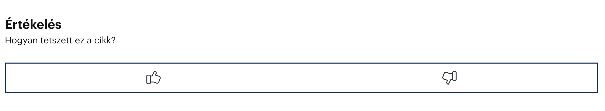
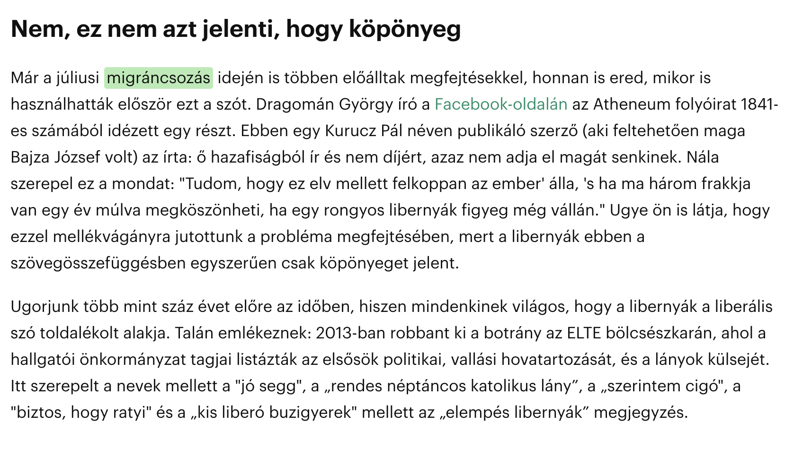

# Telex.hu – Unoficcial Chrome Extension

>Public beta release date: 15th of October, 2020

🇭🇺  Disclaimer: Ez egy <i>unofficial</i> telex.hu chrome extension. A telex.hu-n megjelenő tartalmak a telex.hu tulajdona.

# Stack

## Dependencies

Ez `Chrome` extensions relies on the following `npm` packages:

-[`webpack`](https://github.com/webpack/webpack)
-[`react`](https://github.com/facebook/react)
-[`redux`](https://github.com/reduxjs/redux)
-[`babel`](https://github.com/babel/babel)
-[`fingerprintjs`](https://github.com/fingerprintjs/fingerprintjs)
-[`node-sass`](https://github.com/sass/node-sass)
-[`axios`](https://github.com/axios/axios)
-[ and more](https://github.com/zilahir/telex.hu/blob/master/package.json)

# Fetures

## Layout

This extension slightly changes the telex.hu layout. It was modified to get more wider, since the `1150px` is quite _narrow_ in the ear of 4K displays. So it got a bit redisgned, to waste less valuable space.

### Home page

Just a list of a couple of things that had been modified:

- wider layout
- removed unncesseray paddings from the header and the footer
- refactoored typography
  - increased font-size in the article titles
  - adjusted font-weights
  - adjusted line heights
- some articles with thumbanil image had been moved to the middle section, to retain consistency.

### Aticle page

### Gallery

The article page also got some layout modification, as well as got a _galley_ feature. In the current version at telex.hu, the images inserted between the paragraphs broke the readability, so if there's more than 3 images in an article, they are removed, organized into a gallery, and moved to the end of the artice. Images are indeed important part of every article, but not if they are abusing the content. 

### New fetures

There are couple of new features intoroduced in the article page.

#### Likes, dislikes

Readers are now able to provide a really basic type of feedbacks: likes, and dislikes.

The option for this is privded at the end of the articles (_rate after read_, right?).

Every reader allowed to rate one article once. To make this possible, the request being sent to the _telex.hu_ microservice (which will be described in a later section of this `README`) stores the user's browser's _fingerprint_. Don't freak out, this is a _pretty standard_ procedure.

#### Revision

Unfortunately, despite teh fact how we all love telex, and being happy about their existance, it would be anfair not to mention how often they make not just typos in their articles, but actual grammatical issues, or producing grammatically incorrect sentences. While making a mistake was never problem, this `Chrome Extension` has a built in `revision system` that allows the users to corrrect the sentences.

The coreccted text are being saved into a database, and waiting for approval. Once it's approved, for readers, having this `extension` installed the corrected text will be visible.

> To be continued... Stay tuned!